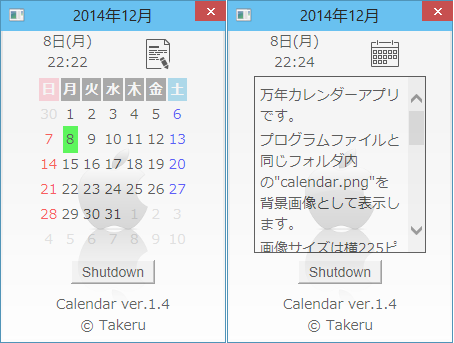

#The calendar application for Microsoft Windows.
Windowsのデスクトップガジェット風カレンダーアプリです。  
[Gistに置いてあるhtaプログラム](https://gist.github.com/Takeru-chan/f44d42b0036f01e5aa0d)からカスタムコードを除いてライセンス表示を追加しました。

I've reduced some code in [an hta program on my Gist](https://gist.github.com/Takeru-chan/f44d42b0036f01e5aa0d).
##Usage | 使い方
Windowsでcalendar.htaを起動します。  
タイトルバーに年月、ウィンドウ中央には今月のカレンダーを表示します。
ウィンドウ上部左側に今日の日付と曜日、現在時刻を表示します。
ウィンドウ上部右側のアイコンは、表示切替ボタンです。
カレンダー下の'Shutdown'ボタンを押すと、Windowsがシャットダウンされます。  
表示切替ボタンを押すと、カレンダー表示とメモ表示を切り替えます。

メモ表示は標準では簡単なヘルプ表示ですが、カスタムにより表示内容を変更できます。  
calendar.htaと同じフォルダに以下のファイルを置くことでカスタマイズが出来ます。
- calendar.png  
 アプリケーションの背景画像として表示されます。画像サイズは横225px、縦315pxです。
- calendar.txt  
 デフォルトのメモ表示内容をテキストファイルの内容に置き換えます。

##License
This program has released under the MIT license.  
[http://opensource.org/licenses/MIT](http://opensource.org/licenses/MIT)
